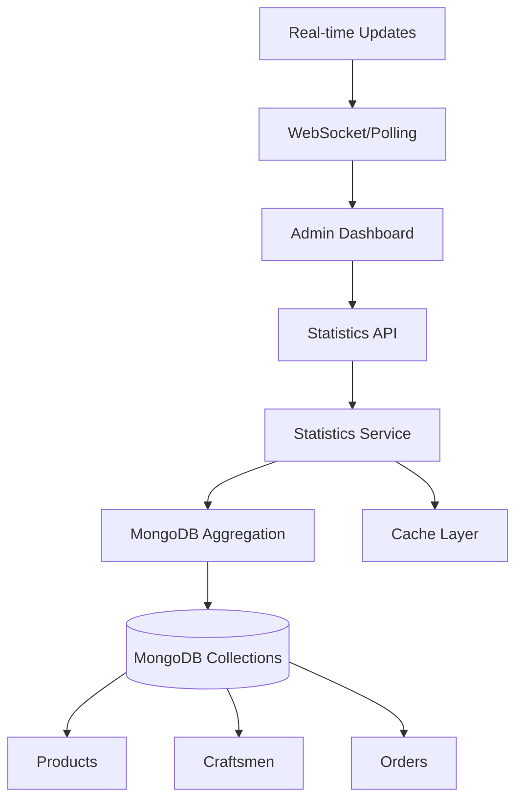

# Design Document

## Overview

This design outlines the implementation of real-time MongoDB-based statistics for the admin panel. The solution will replace hardcoded values with dynamic data fetched from the database, including a new "tahrirlar" (edits) statistics section that tracks recent modifications to system entities.

The design focuses on creating efficient API endpoints for statistics aggregation, updating the frontend components to consume real data, and implementing proper error handling and loading states.

## Architecture

### Backend Architecture



### Data Flow

1. **Frontend Request**: Admin dashboard requests statistics data
2. **API Layer**: Statistics endpoint receives request
3. **Service Layer**: Statistics service aggregates data from multiple collections
4. **Database Layer**: MongoDB performs aggregation queries
5. **Response**: Formatted statistics returned to frontend
6. **UI Update**: Dashboard updates with real-time data

## Components and Interfaces

### Backend Components

#### 1. Statistics API Endpoint (`/api/statistics`)

**Purpose**: Centralized endpoint for all admin statistics

**Methods**:
- `GET /api/statistics/dashboard` - Get all dashboard statistics
- `GET /api/statistics/edits` - Get edit/modification statistics
- `GET /api/statistics/revenue` - Get revenue calculations

#### 2. Statistics Service

**Purpose**: Business logic for statistics calculations

**Key Methods**:
```javascript
class StatisticsService {
  async getDashboardStats()
  async getEditStats(days = 30)
  async getRevenueStats()
  async getActivityStats(days = 7)
}
```

#### 3. Database Aggregation Queries

**Purpose**: Efficient data aggregation using MongoDB aggregation pipeline

**Key Aggregations**:
- Total counts for each entity type
- Recent modifications tracking
- Revenue calculations from completed orders
- Activity metrics and trends

### Frontend Components

#### 1. Enhanced AdminStatsCards Component

**Purpose**: Display real-time statistics with loading states

**Props**:
```javascript
{
  statistics: {
    craftsmen: { total, active, inactive },
    products: { total, active, inactive },
    orders: { total, pending, completed, cancelled },
    revenue: { total, thisMonth, lastMonth },
    edits: { total, thisWeek, thisMonth }
  },
  loading: boolean,
  error: string
}
```

#### 2. Statistics Hook

**Purpose**: Custom hook for fetching and managing statistics data

```javascript
const useStatistics = () => {
  const [statistics, setStatistics] = useState(null);
  const [loading, setLoading] = useState(true);
  const [error, setError] = useState(null);
  
  // Methods for fetching and refreshing data
}
```

## Data Models

### Statistics Response Model

```javascript
{
  craftsmen: {
    total: Number,
    active: Number,
    inactive: Number,
    busy: Number,
    recentlyAdded: Number // last 7 days
  },
  products: {
    total: Number,
    active: Number,
    inactive: Number,
    recentlyAdded: Number, // last 7 days
    categories: Number // unique categories count
  },
  orders: {
    total: Number,
    pending: Number,
    processing: Number,
    shipped: Number,
    delivered: Number,
    cancelled: Number,
    recentlyCreated: Number // last 7 days
  },
  revenue: {
    total: Number,
    thisMonth: Number,
    lastMonth: Number,
    growth: Number, // percentage
    averageOrderValue: Number
  },
  edits: {
    total: Number, // last 30 days
    thisWeek: Number,
    thisMonth: Number,
    byType: {
      products: Number,
      craftsmen: Number,
      orders: Number
    }
  },
  activity: {
    last7Days: Array, // daily activity counts
    peakHours: Array, // hourly activity distribution
    mostActiveDay: String
  }
}
```

### Edit Tracking Model

Since MongoDB doesn't have built-in audit trails, we'll track edits using the `updatedAt` timestamps:

```javascript
// Aggregation query to count recent edits
{
  $match: {
    updatedAt: {
      $gte: new Date(Date.now() - 30 * 24 * 60 * 60 * 1000) // last 30 days
    },
    // Exclude documents where createdAt === updatedAt (new documents)
    $expr: { $ne: ["$createdAt", "$updatedAt"] }
  }
}
```

## Error Handling

### Backend Error Handling

1. **Database Connection Errors**: Graceful fallback with cached data
2. **Aggregation Errors**: Return partial data with error flags
3. **Timeout Handling**: Set reasonable timeouts for complex queries
4. **Validation Errors**: Proper error messages for invalid requests

### Frontend Error Handling

1. **Network Errors**: Display retry options
2. **Loading States**: Show skeleton loaders during data fetch
3. **Partial Data**: Handle cases where some statistics fail to load
4. **Fallback Values**: Display last known values when real-time data unavailable

## Testing Strategy

### Backend Testing

1. **Unit Tests**:
   - Statistics service methods
   - Aggregation query correctness
   - Error handling scenarios

2. **Integration Tests**:
   - API endpoint responses
   - Database aggregation accuracy
   - Performance under load

3. **Performance Tests**:
   - Query execution time
   - Memory usage during aggregation
   - Concurrent request handling

### Frontend Testing

1. **Component Tests**:
   - Statistics display accuracy
   - Loading state handling
   - Error state rendering

2. **Hook Tests**:
   - Data fetching logic
   - State management
   - Error recovery

3. **Integration Tests**:
   - End-to-end statistics flow
   - Real-time update behavior
   - Cross-browser compatibility

## Performance Considerations

### Database Optimization

1. **Indexing Strategy**:
   - Index on `updatedAt` for edit tracking
   - Index on `status` fields for filtering
   - Index on `createdAt` for time-based queries

2. **Aggregation Optimization**:
   - Use `$match` early in pipeline
   - Limit result sets where possible
   - Consider pre-computed statistics for heavy queries

3. **Caching Strategy**:
   - Cache statistics for 5-10 minutes
   - Invalidate cache on data modifications
   - Use Redis for distributed caching if needed

### Frontend Optimization

1. **Data Fetching**:
   - Implement request debouncing
   - Use React Query for caching
   - Implement optimistic updates where appropriate

2. **Rendering Optimization**:
   - Memoize expensive calculations
   - Use React.memo for statistics cards
   - Implement virtual scrolling for large datasets

## Security Considerations

1. **API Security**:
   - Validate admin authentication
   - Rate limiting on statistics endpoints
   - Input sanitization for query parameters

2. **Data Privacy**:
   - Aggregate data only, no personal information
   - Implement proper access controls
   - Log access to sensitive statistics

## Implementation Phases

### Phase 1: Backend Statistics API
- Create statistics service
- Implement aggregation queries
- Add API endpoints
- Add basic error handling

### Phase 2: Frontend Integration
- Update AdminStatsCards component
- Create statistics hook
- Implement loading states
- Add error handling

### Phase 3: Edit Tracking
- Implement edit statistics calculation
- Add tahrirlar section to UI
- Create edit activity tracking

### Phase 4: Performance & Polish
- Add caching layer
- Optimize database queries
- Implement real-time updates
- Add comprehensive testing