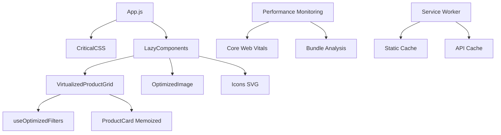
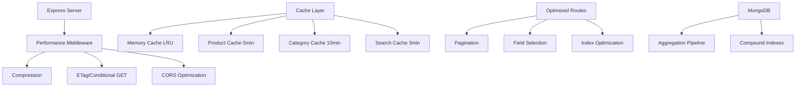

# Design Document - Performance Optimization

## Overview

Данный дизайн описывает комплексную архитектуру оптимизации производительности для интернет-магазина «Qurilish Bozori». Решение основано на современных подходах к веб-производительности: виртуализации, code splitting, оптимизации изображений, кэшировании и критическом рендерингу.

Ключевые принципы дизайна:
- **Прогрессивная загрузка**: критический контент загружается первым
- **Виртуализация**: рендеринг только видимых элементов
- **Мемоизация**: предотвращение лишних перерисовок
- **Кэширование**: многоуровневое кэширование данных и ресурсов
- **Обратная совместимость**: сохранение всей существующей функциональности

## Architecture

### Frontend Architecture



### Backend Architecture



## Components and Interfaces

### 1. Critical CSS Component

**Назначение**: Инлайн критические стили для первого экрана

```javascript
// CriticalCSS.jsx
interface CriticalCSSProps {
  // Инлайн стили для критического рендеринга
  // Размер: ~15KB, цель: ≤ 20KB
}
```

**Ключевые особенности**:
- Инлайн стили для навигации, сетки товаров, карточек
- Skeleton анимации для состояний загрузки
- Responsive дизайн для мобильных устройств
- CSS-утилиты для производительности (content-visibility, contain)

### 2. Virtualized Product Grid

**Назначение**: Виртуализированный список товаров с оптимизацией рендеринга

```javascript
// VirtualizedProductGrid.jsx
interface VirtualizedProductGridProps {
  products: Product[];
  onAddToCart: (product: Product) => void;
  onToggleFavorite: (productId: string) => void;
  onShare: (product: Product) => void;
  containerHeight?: number;
  itemWidth?: number;
  itemHeight?: number;
}
```

**Архитектурные решения**:
- **React Window**: виртуализация для больших списков
- **Memoized ProductCard**: предотвращение лишних перерисовок
- **Deferred Values**: плавность при фильтрации
- **Content Visibility**: оптимизация рендеринга браузера
- **Overscan**: предзагрузка 2 строк для плавной прокрутки

### 3. Optimized Filters Hook

**Назначение**: Оптимизированная фильтрация с debounce и transitions

```javascript
// useOptimizedFilters.js
interface OptimizedFiltersReturn {
  filters: FilterState;
  filteredProducts: Product[];
  updateFilter: (key: string, value: any) => void;
  updateFilters: (filters: Partial<FilterState>) => void;
  resetFilters: () => void;
  isPending: boolean;
  stats: FilterStats;
}
```

**Оптимизации**:
- **Debounce**: 300ms для поиска, 400ms для цены
- **useDeferredValue**: плавность UI при фильтрации
- **useTransition**: неблокирующие обновления
- **Memoized filtering**: кэширование результатов фильтрации

### 4. Optimized Image Component

**Назначение**: Современные форматы изображений с fallback

```javascript
// OptimizedImage.jsx
interface OptimizedImageProps {
  src: string;
  alt: string;
  width?: number;
  height?: number;
  sizes?: string;
  priority?: boolean;
  placeholder?: boolean;
}
```

**Форматы поддержки**:
1. **AVIF** - для современных браузеров (50% меньше размер)
2. **WebP** - для большинства браузеров (30% меньше размер)
3. **JPEG/PNG** - fallback для старых браузеров

**Оптимизации**:
- Responsive images с srcSet
- Lazy loading для изображений вне viewport
- Priority loading для критических изображений
- Skeleton placeholders во время загрузки

### 5. SVG Icons System

**Назначение**: Замена Font Awesome на оптимизированные SVG иконки

```javascript
// Icons.jsx
export const SearchIcon, TimesIcon, PlusIcon, MinusIcon, 
             HeartIcon, ShareIcon, ShoppingCartIcon
```

**Преимущества**:
- **Размер**: ~2KB вместо ~70KB Font Awesome
- **Производительность**: нет блокирующих запросов к CDN
- **Кастомизация**: полный контроль над стилями
- **Tree shaking**: загружаются только используемые иконки

### 6. Backend Performance Layer

**Назначение**: Middleware для оптимизации серверной производительности

```javascript
// performance.js
interface PerformanceMiddleware {
  compression: CompressionMiddleware;
  helmet: SecurityMiddleware;
  staticCache: CacheMiddleware;
  etag: ETagMiddleware;
  cors: CORSMiddleware;
  conditionalGet: ConditionalGetMiddleware;
  performanceMonitor: MonitoringMiddleware;
}
```

**Компоненты**:
- **Compression**: gzip/brotli сжатие ответов
- **ETag**: условные GET запросы
- **Static Cache**: кэширование статики на 1 год
- **Performance Monitor**: логирование медленных запросов
- **CORS**: оптимизированные CORS заголовки

### 7. Memory Cache System

**Назначение**: Многоуровневое кэширование с LRU и TTL

```javascript
// cache.js
interface CacheSystem {
  productCache: MemoryCache; // 5 минут, 500 записей
  categoryCache: MemoryCache; // 10 минут, 100 записей  
  searchCache: MemoryCache; // 3 минуты, 200 записей
}
```

**Особенности**:
- **LRU eviction**: удаление старых записей при переполнении
- **TTL support**: автоматическое истечение кэша
- **Cache headers**: X-Cache HIT/MISS для отладки
- **Invalidation**: программная очистка кэша

## Data Models

### Performance Metrics Model

```javascript
interface PerformanceMetrics {
  lcp: number; // Largest Contentful Paint ≤ 2.5s
  cls: number; // Cumulative Layout Shift ≤ 0.1
  inp: number; // Interaction to Next Paint ≤ 200ms
  bundleSize: number; // JavaScript bundle ≤ 200KB gzipped
  apiResponseTime: number; // API response time
  cacheHitRate: number; // Cache efficiency
}
```

### Optimized Product Model

```javascript
interface OptimizedProduct {
  _id: string;
  name: string;
  description?: string;
  price: number;
  image: string;
  category: string;
  updatedAt: Date;
  // Оптимизированные поля для фильтрации
  searchText: string; // pre-computed lowercase search text
  priceNumber: number; // pre-computed numeric price
}
```

### Cache Entry Model

```javascript
interface CacheEntry<T> {
  value: T;
  expiresAt: number;
  createdAt: number;
  hitCount: number;
}
```

## Error Handling

### Frontend Error Boundaries

```javascript
// ErrorBoundary для lazy components
class PerformanceErrorBoundary extends React.Component {
  // Fallback UI для ошибок загрузки компонентов
  // Retry механизм для network errors
  // Graceful degradation для unsupported features
}
```

### Backend Error Handling

```javascript
// Middleware для обработки ошибок производительности
const performanceErrorHandler = {
  // Timeout handling для медленных запросов
  // Memory limit protection
  // Cache error recovery
  // Graceful degradation при недоступности MongoDB
}
```

### Image Loading Errors

```javascript
// OptimizedImage error handling
const imageErrorHandling = {
  // Fallback к следующему формату (AVIF → WebP → JPEG)
  // Placeholder при ошибке загрузки
  // Retry mechanism для network errors
  // Lazy loading error recovery
}
```

## Testing Strategy

### Performance Testing

1. **Lighthouse CI Integration**
   - Автоматические тесты Core Web Vitals
   - Regression testing для bundle size
   - Performance budget enforcement

2. **Load Testing**
   - API endpoint performance под нагрузкой
   - Cache efficiency testing
   - Memory leak detection

3. **Visual Regression Testing**
   - Скриншот тесты для UI consistency
   - Cross-browser compatibility
   - Mobile responsiveness

### Unit Testing

```javascript
// Тесты для оптимизированных компонентов
describe('VirtualizedProductGrid', () => {
  test('renders only visible items');
  test('handles large datasets efficiently');
  test('maintains scroll position');
});

describe('useOptimizedFilters', () => {
  test('debounces search input');
  test('memoizes filter results');
  test('handles concurrent updates');
});
```

### Integration Testing

```javascript
// End-to-end тесты производительности
describe('Performance Integration', () => {
  test('page loads within 2.5s');
  test('smooth scrolling with 1000+ products');
  test('cache invalidation works correctly');
  test('graceful degradation without JavaScript');
});
```

### Monitoring and Analytics

```javascript
// Real User Monitoring (RUM)
const performanceMonitoring = {
  // Core Web Vitals collection
  // Bundle size tracking
  // API response time monitoring
  // Cache hit rate analytics
  // Error rate tracking
}
```

## Implementation Phases

### Phase 1: Foundation (Critical Path)
- Critical CSS implementation
- SVG icons replacement
- Basic performance monitoring

### Phase 2: Core Optimization
- Virtualized product grid
- Optimized filters hook
- Image optimization system

### Phase 3: Backend Optimization
- Cache layer implementation
- API performance middleware
- Database query optimization

### Phase 4: Advanced Features
- Service worker implementation
- Advanced monitoring
- Performance budgets

## Performance Targets

| Metric | Current | Target | Method |
|--------|---------|--------|---------|
| LCP | ~4-5s | ≤ 2.5s | Critical CSS, Image optimization |
| CLS | ~0.3 | ≤ 0.1 | Skeleton UI, Reserved space |
| INP | ~300ms | ≤ 200ms | Debouncing, Memoization |
| Bundle Size | ~47KB | ≤ 200KB | Code splitting, Tree shaking |
| API Response | ~500ms | ≤ 300ms | Caching, Query optimization |
| Cache Hit Rate | 0% | ≥ 80% | Multi-level caching |

## Browser Support

- **Modern browsers**: Full feature support (Chrome 90+, Firefox 88+, Safari 14+)
- **Legacy browsers**: Graceful degradation with polyfills
- **Mobile browsers**: Optimized for mobile performance
- **Progressive enhancement**: Core functionality works without JavaScript